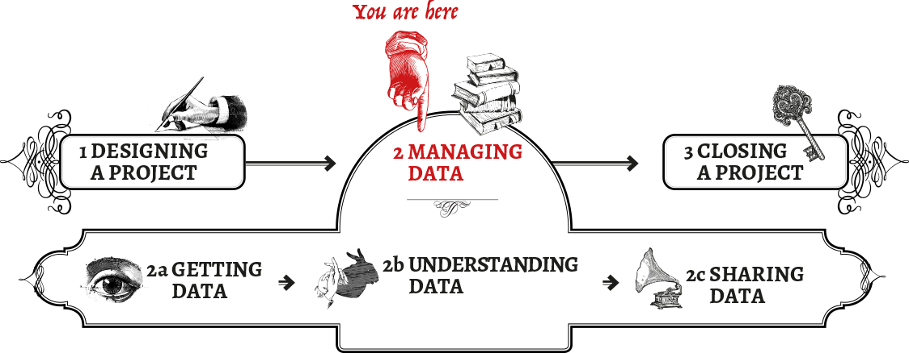
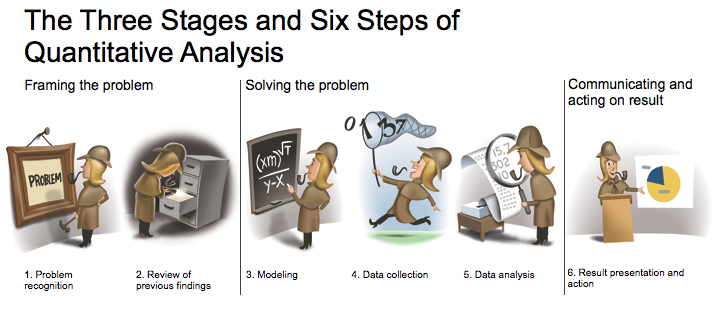
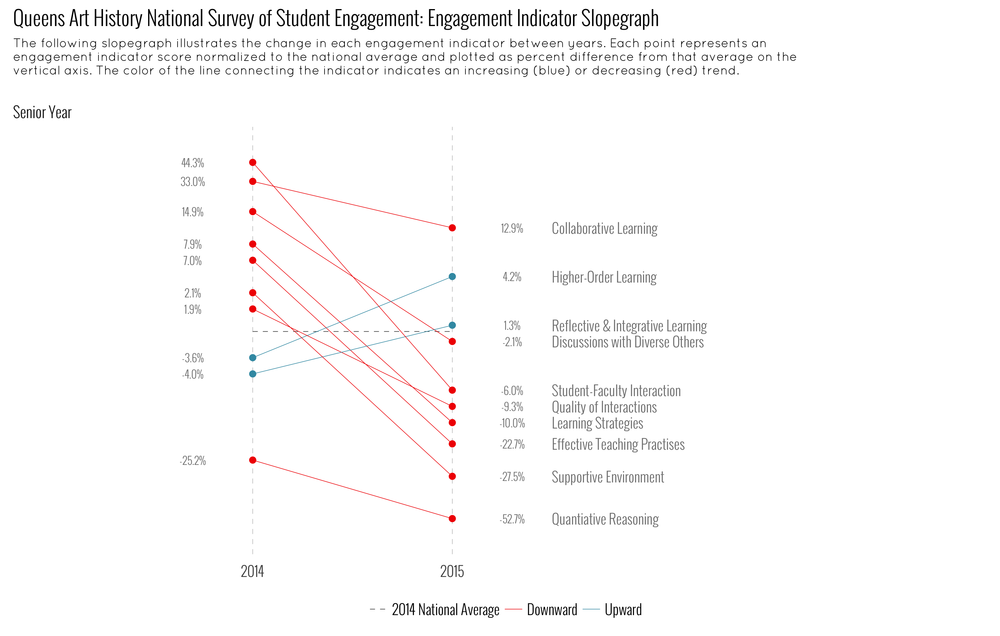

---
output:
  xaringan::moon_reader:
    css: "pres.css"
    seal: FALSE
    nature:
      ratio: '16:9'
      autoplay: FALSE
---

```{r setup, include=FALSE}
options(htmltools.dir.version = FALSE)
```

class: center, middle
layout: false

.title[Data, Workflows and R]

.pull-right[.author[Jake Kaupp]

.date[`r Sys.Date()`]]

---
class: center, middle, inverse

#.pull-left[The Story So Far....]

???
I traveled a strange road to get to where I am.

I'm not a programmer, a sysadmin or software developer. I'm an engineer, an educational researcher with a head for numbers, graphics and design.

How did I get involved with data, workflows, R and open-source software?

---
class: center, bottom
background-image: url(images/drowning-in-data.jpg)
background-size: cover

???

I was asked to help the programs make sense of their assessment data, and 'make some reports' illustrating student performance.  It started with making histograms in SPSS, putting that into pages and producing PDF reports.  I quickly realized that this would be far too time intensive and need to script things.  I started to write SAS Macros for SPSS which was it's own separate circle of hell, threw my hands up in frustration and took Brian's suggestion to look into R.
---
class: center, bottom
background-image: url(images/spaceman.jpg)
background-repeat: no-repeat
background-size: cover

???

It took me a while, but I started to develop the capacity to do a lot of things, from making rudimentary graphs, processing and cleaning data, to developing reports, writing papers, producing graphics, etc. I could do things quickly myself by scripting, but then I had issues of scale and automation.

---
class: center, bottom
background-image: url(images/legos.jpg)
background-size: cover

???

I had to learn to get from this....

---
class: center, bottom
background-image: url(images/lego_ny.jpg)
background-size: cover

???

To this! How the heck was I going to do this?

---
class: center, middle, inverse

#.oswald_bold[Software Development Principles,<br>] .scope[Research Methodologies,<br>].oswald_bold[Analytical Methods &<br>] .scope[Open Source Tools]

???

I won't go on, but this boils down to adopting parts of agile and lean, taking a framework driven approach to answer questions, adopting coding and analysis paradigms from data science, and using lightweight, effective and amazing open source tools to boost efficiency and minimize cost.

---
class: center, middle
background-image: url(images/open_tools.jpg)
background-size: cover

???
Things that allow you to work outside of interfaces and editing, work in plaintext, focus on writing and coding, style it how you want later, export it to whatever format you want.  It also integrates version control tools and collaborative platforms, and uses tools to automate, schedule and build projects with a single command.

These tools encourage reproducibility, and a focus on literate programming (ingerating data, code, analysis, visualization and communication) in the form of interactive notebooks.  The key for reproducibility is packaging everything into one location (git), making it widely available (github). You can now even make sure the environment is replicable with docker!


---
class: center, middle

.pull-left[.oswald_bold[Data Project Workflow<br>]]
.pull-right[.oswald_bold[Research Workflow<br>]]<br>


???

All of these tools together form the backbone for any data-related project, and can be used in concert for what I've been saying this entire time.  A workflow.  You can use these tools in concert to start up projects quickly; clean, store and analyze data; explore, visualize and communicate results, and do so in an automated, replicable fashion that is set up from the start to encourage collaboration.
---
class: center, bottom
background-image: url(images/Spectrum_of_reproducible_research.png)
background-size: 100%

[https://ropensci.github.io/reproducibility-guide/sections/introduction/]()
???

It's also a cornerstone in the Open Science Movement for Open or Reproducible research.

---
class: left, middle, inverse

# Why is this Relevant?

---
class: center, middle

.stylish_title[Post-Truth]
https://fatiherikli.github.io/post-truth/  
https://www.theguardian.com/politics/2017/jan/19/crisis-of-statistics-big-data-democracy

---
class: center, middle
.stylish_title[Reproducibility Crisis]  
http://www.nature.com/news/1-500-scientists-lift-the-lid-on-reproducibility-1.19970


---
class: left, middle
background-image: url(images/beaker.jpg)
background-size: 100%
.yellow[Closer to Home]

???
Uncertainty and questions surround institutional statistics at Queen's.  Programs provided statistics by a number of sources.  Yet verification of these items is incredibly difficult because most analysts do not follow a reproducible model.  Data is pulled from a central source, manipulated in excel and provided as a table with little context.

---
class: left, middle, inverse

#So what does R have to do with all of this?

???

I think it can help solve a lot of these issues.  Introduce researchers and graduate students to scientific computing. Introduce analysts to literate programming and reproducible analysis.  Get the community thinking about how to package their research and engage in collaborative analysis.  

It is also the tool that I've based my entire job around.

---
background-image: url(images/toothpaste-orange-juice.jpg)
background-size: 100%

???

I know that Quality Assurance and Statistical Computing are a strange pairing. I pitched the job in my interview to heavily use R, and rarely a day goes by that I don't work in it.  It powers all the FEAS statistics and reporting, it is the engine behind the accreditation reporting, and it is the platform that provides a lot of actionable information to programs for QA purposes.

---
class: left, middle

# So what is R?
.pull-left[]
.pull-right[.big_text[
* A Statistical computing language

* A computing environment  

* A high quality graphical system  

* An open-source standard for Statistics and Data Science

* An extensible and integrated framework]]

---
class: left, middle

# Also RStudio*!
.pull-left[]
.pull-right[.big_text[
* A powerful open-source IDE and companion to R.
* Integrates author tools into a powerful suite.
* Focuses on Workflows 
* Excellent help and support for learning]]

.footnote[*A company that contributes lots of good packages and tools to the R community. For free.]

---
class: left, middle, inverse

#What can it do?

???

It can do a lot.  I learned very quickly that is wasn't a question of Can I do that in R? it was a question of How do I do that in R?.  The massive amount of functionality provided by R is in part due to its extensible nature and passionate user base that has developed 10,000+ packages that give R a tremendous reach.  All of this in open-source, all freely available.

---

#Basic Computing!
All of the basic things programming langauges can do.  Math, Matricies, Loops, Case Statements.
```{r basic}
2 + 2

array <- runif(10000, 1, 100)

summary(array)

```
---

# Readable Code!
Using pipes (%>%) to turn inside-out hard to read code into top-down readable code
```{r literate, warning = FALSE, message = FALSE}
library(dplyr)

mtcars %>%
  select(mpg, wt, cyl) %>%
  group_by(cyl) %>%
  mutate(mpg_by_weight = mpg/wt) %>%
  summarize_each(funs(mean))

```
---
#Plotting!
.pull-left[Fully customizable plots that follow effective practise of visualization and graphic design.

```{r plots, fig.height=6, eval = FALSE}
library(ggplot2)
library(viridis)

ggplot(diamonds, aes(carat, price)) +
  geom_point(aes(color = clarity)) +
  scale_color_viridis(discrete = TRUE)
```
]
.pull-right[
```{r plots2, fig.height=6, eval = TRUE, echo = FALSE}
library(ggplot2)
library(viridis)
ggplot(diamonds, aes(carat, price, color = clarity)) +
  geom_point() +
  scale_color_viridis(discrete = TRUE)
```
]

---
#More plotting!
.pull-left[Can facilitate comparison via small multiples (panels)

```{r sm, fig.height = 6, eval = FALSE}
ggplot(diamonds, aes(carat, price)) +
  geom_point(color = clarity) +
  facet_wrap(~color) +
  scale_color_viridis(discrete = TRUE)
```
]
.pull-right[
```{r sm2, fig.height = 6, echo = FALSE}
ggplot(diamonds, aes(carat, price, color = clarity)) +
  geom_point() +
  facet_wrap(~color) +
  scale_color_viridis(discrete = TRUE)
```
]

---

# Interactive Plotting!
.pull-left[Links to popular javascript libraries for interactive graphics

```{r plotly, echo = TRUE, eval = FALSE, warning = FALSE, message= FALSE}
library(plotly)

d <- diamonds[sample(nrow(diamonds), 500), ]
plot_ly(d, x = ~carat, y = ~price, color = ~carat,
        size = ~carat, text = ~paste("Clarity: ", clarity))
```
]
.pull-right[
```{r plotly2, echo = FALSE, warning = FALSE, message= FALSE, fig.width = 4}
library(plotly)

d <- diamonds[sample(nrow(diamonds), 500), ]
plot_ly(d, x = ~carat, y = ~price, color = ~carat,
        size = ~carat, text = ~paste("Clarity: ", clarity))
```
]

---
#Writing Documents/Books/Websites/Presentations!
This entire presentation was written in R & Rstudio using markdown, inline R code, and an R package that uses a javascript presentation engine.

.big_text[* Write in Markdown.
* Write native code in R.
* Use **knitr** and pandoc to create a wealth of formats!
* Keep data, analysis and writing in one place!]

---

# The Package Ecosystem linking all the things!
.pull-left[.big_text[
* Google Drive!

* Search engines!

* Countless APIs!

* Databases!]]

.pull-right[]


---

```{r gs, message=FALSE, warning=FALSE}
library(googlesheets)
 gs_title("CEAB Enrolment 2011-2015") %>% 
  gs_read("total_enrolment")
```

---

```{r db, message=FALSE, warning=FALSE}
library(DBI)
quiver <- RSQLServer::src_sqlserver("FEAS", database = "quiver")
 
quiver %>% 
  tbl("course_au")
```

---

#Sophisticated analytical workflows!
Keep everything from data to results in one place!

```{r wf, warning=FALSE, message=FALSE}
library(tidyverse)

analysis <- mtcars %>% 
  group_by(cyl) %>% 
  nest() %>% 
  mutate(model = map(data,~ lm(mpg ~ wt, data = .))) %>% 
  mutate(results = map(model, broom::tidy))

analysis$results[[1]]
```

---
# Write your own packages!

.pull-left[
```{r nsseR, eval = FALSE}
library(NSSEr)
file <- "/Users/Jake/ownCloud/FEAS/NSSE/data/ENG//NSSE 2014 Engineering.xlsx"

nsse_tidy_workbook(file) %>% 
   nsse_compare_indicators() %>% 
   nsse_indicator_slopegraph()
```
]
.pull-right[]

---
class: center, middle

.pull-left[# Web Applications!

[.big_text[Reactivity and Interaction in R-powered apps]](http://shiny.engineering.queensu.ca)]


---
class: left, middle, inverse

# So how do I learn R?

---

# A R-user group at Queen's is starting up!

* Collaboration between Me and Jeff Stafford of the Center for Advanced Computing
* Offering Training for Researchers, Professors, Students
* Teaching sessions and drop-ins!
* Get more people using the tools, techniques and workflows behind scientific computing!

---
class: left, middle, inverse

#Thank you!

